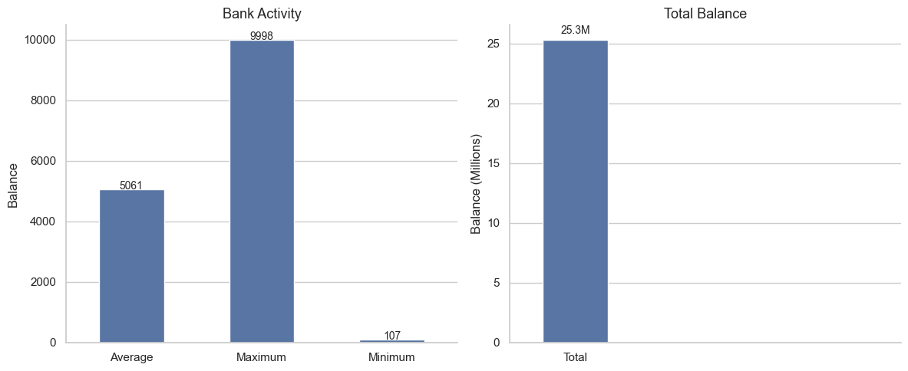
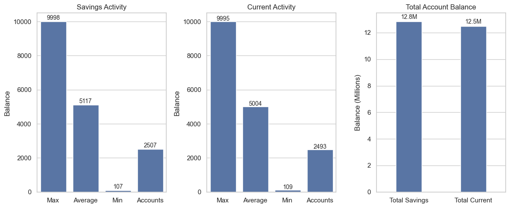
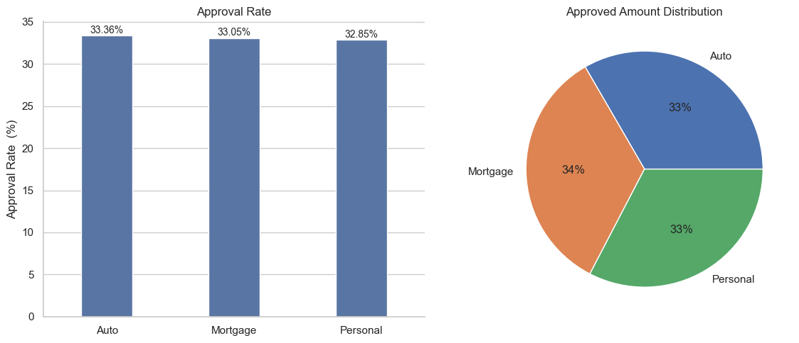
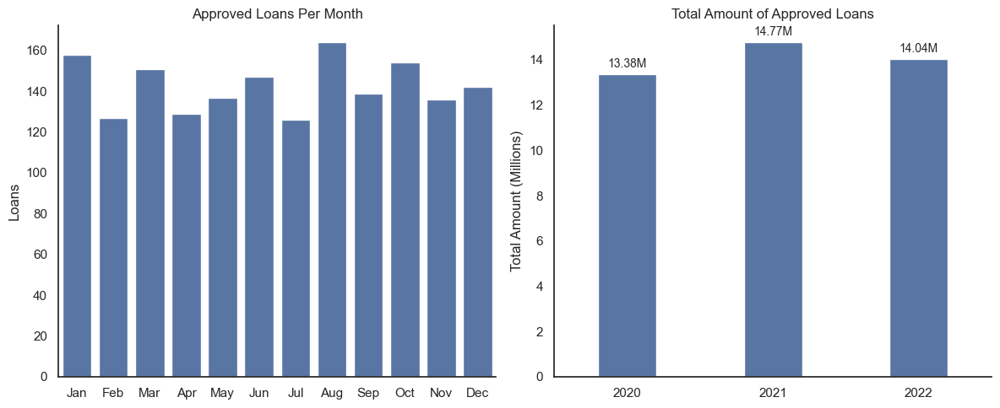
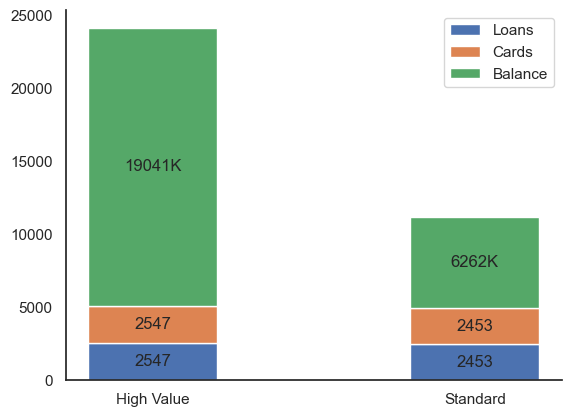

# Introduction
This project focuses on analyzing banking customer data to identify behavioral patterns and segment customers based on their financial activity. By combining SQL queries with Python-based data analysis and visualization, the project aims to generate actionable insights.

SQL queries: [SQL_Banking_Project](/SQL_Banking_Project/)

# Backround
The analysis is based on aggregated customer-level features such as total balance, number of loan types and number of card types. These indicators are visualized to compare customer segments and highlight differences in financial engagement.

### The questions I wanted to answer through my SQL queries were:

1. What is the total, average, maximum and minimum account balance of the bank?
2. Which account type has the maximum average account balance? What is the maximum total balance?
3. What is the approval rate of loans and the total value of approved loans?
4. How many loans were approved every month/year? What is the total amount of these loans per month/year?
5. Which customers have total account balance over 5000? How many loans and cards do they own and what is their total balance?

# Tools I Used
For this banking customer segmentation project, I relied on a set of essential tools to extract, process and visualize the data:

- **SQL:** Used to retrieve and aggregate customer-level information, transforming raw banking records into meaningful analytical features.

- **PostgreSQL:** Served as the relational database system for storing and managing the structured financial dataset.

- **Python:** Applied for data manipulation and building visualizations to compare customer segments.

- **Visual Studio Code:** Provided an efficient development environment for writing queries and running the analysis 
workflow.

- **Git & GitHub:** Enabled version control, project organization and structured documentation of the analytical process.

# The Analysis
Each query in this project was designed to explore different dimensions of customer financial behavior. Here’s how I approached each question:

### 1. Overall Account Balance Overview
To understand the bank’s financial standing, I calculated the total, average, maximum and minimum account balances across all customers. This query provides a high-level snapshot of the institution’s overall liquidity distribution and highlights the range of customer account values.

```sql
SELECT 
    AVG(account_balance) as avg_account_balance,
    SUM(account_balance) as total_account_balance,
    MAX(account_balance) as max_account_balance,
    MIN(account_balance) as min_account_balance
FROM banking_data
```

### Key Insights
The bank’s accounts show an **average balance** of 5,061.57 and a **total balance** of 25,302,854.59, with a **maximum** of 9,998.11 and a **minimum** of 107.2. This wide range highlights a diverse customer base, from low-activity to high-value accounts.

### Data Visualization

```python
fig, ax=plt.subplots(1, 2, figsize=(12,5))
sns.barplot(Df, x='metrics', y='sizes', width=0.5, ax=ax[0])
sns.set_theme(style='whitegrid')
for i, value in enumerate(Df["sizes"]):
    ax[0].text(i, value + 0.5, f"{value}", ha="center", fontsize=10)
ax[0].set_title('Bank Activity', fontsize=13)
ax[0].set_xlabel("")
ax[0].set_ylabel("Balance")
```
### Results



*Visualizes the overall account balance.*

### 2. Account Type Comparison
To evaluate which types of accounts hold the most value, I calculated the average and total balances for each account type. This query highlights which account types contribute most to the bank’s overall liquidity and which serve as high-value accounts for the institution.

```sql
SELECT 
    account_type,
    AVG(account_balance) as avg_account_balance,
    SUM(account_balance) as total_account_balance,
    MAX(account_balance) as max_account_balance,
    MIN(account_balance) as min_account_balance,
    COUNT(*) as accounts
FROM 
    banking_data
GROUP BY
    account_type
ORDER BY
    account_type DESC
```

### Key Insights
-**Savings accounts** have a slightly higher average balance than current accounts, suggesting they tend to hold more per customer.

-**Total balance** is also higher for savings accounts, indicating that this account type contributes the most to the bank’s overall liquidity.

-The comparison helps identify which account type is the primary driver of funds and which might be targeted for growth or promotional strategies.

### Data Visualization

```python
total =pd.DataFrame({
    "total": ["Total Savings", "Total Current"],
    "balance": [12828982 / 1_000_000, 12473872 / 1_000_000] 
})

fig, ax = plt.subplots(1, 3, figsize=(12, 5))

sns.set_theme(style="whitegrid")
sns.barplot(savings, x="metrics", y="sizes", ax=ax[0])
for i, value in enumerate(savings['sizes']):
    ax[0].text(i, value + 100, f"{value}", ha='center', fontsize=10)
ax[0].set_xlabel("")
ax[0].set_ylabel("Balance")
ax[0].set_title("Savings Activity")
```

### Results



*Visualizes the account types activity.*

### 3. Loan Approval Rate
This query examines the approval rate of loans and the total value of approved loans across different loan types. It provides insight into which loan products are most frequently approved and which generate the largest approved amounts for the bank.

```sql
SELECT 
    loan_type,
    loan_status,
    COUNT(*) as loan_accounts,
    SUM(
       CASE WHEN loan_status = 'Approved' THEN loan_amount
        ELSE 0
        END
    ) as approved_amount,
    SUM(loan_amount) as total_amount
FROM
    banking_data
GROUP BY
    loan_type,
    loan_status
ORDER BY
    loan_type DESC
```
### Key Insights

-The **approval rate** varies by loan type, highlighting differences in risk assessment or customer eligibility.

-The **total approved amount** shows which loan types contribute most to the bank’s disbursed capital.

-Combining these metrics helps the bank understand both volume (number of loans approved) and value (total approved funds) across its loan products.

### Data Visualization

```python
approved_df = df_loans[df_loans["loan_status"] == "Approved"].groupby("loan_type")["approved_amount"].sum().reset_index()
total_df = df_loans.groupby("loan_type")["total_amount"].sum().reset_index()
loan_summary = total_df.merge(approved_df, on='loan_type', how='left')
loan_summary['approved_amount'] = loan_summary['approved_amount'].fillna(0)
loan_summary['approval_rate'] = (loan_summary['approved_amount'] / loan_summary['total_amount']) * 100
loan_summary["approved_millions"] = loan_summary["approved_amount"] / 1_000_000

sns.barplot(data=loan_summary, x="loan_type", y="approval_rate", ax=ax[0], width=0.4)
for i, value in enumerate(loan_summary["approval_rate"]):
    ax[0].text(i, value + 0.3, f"{value:.2f}%", ha="center", fontsize=10)
ax[0].set_title("Approval Rate")
ax[0].set_ylabel("Approval Rate  (%)")
ax[0].set_xlabel("")

ax[1].pie(loan_summary["approved_amount"], labels=loan_summary["loan_type"], autopct="%.0f%%")
ax[1].set_title("Approved Amount Distribution")
```

### Results



*Visualizes both the approval rate and the approved amount distribution.*

### 4. Monthly and Yearly Approved Loans
This query tracks the number of approved loans and the total approved loan amount over time, both by month and by year. It provides a temporal view of loan activity, highlighting trends and seasonal patterns in loan approvals.

```sql
SELECT 
    loan_type,
    SUM(loan_amount) as total_amount,
    COUNT(*) as loan_count,
    EXTRACT(MONTH FROM approval_rejection_date) as Month,
    EXTRACT(YEAR FROM approval_rejection_date) as Year
FROM
    banking_data
WHERE
    loan_status = 'Approved'
GROUP BY
    Month,
    Year,
    loan_type
ORDER BY
    Year DESC,
    Month DESC 
```

### Key Insights

-The **monthly** breakdown reveals seasonal fluctuations in loan approvals, helping identify peak periods of customer borrowing.

-The **yearly** totals show overall growth or decline in approved loan amounts over the years, indicating long-term lending trends.

-These insights allow the bank to plan resources, adjust risk management and target marketing efforts based on when loan demand is highest.

### Data Visualization

```python
sns.barplot(monthly, x='month', y='loan_count', errorbar=None, ax=ax[0])
ax[0].set_xlabel("")
ax[0].set_ylabel("Loans")
ax[0].set_title("Approved Loans Per Month")

sns.barplot(yearly, x="year", y="total_amount", errorbar=None, ax=ax[1], width=0.4)
for i, value in enumerate(yearly['total_amount']):
    ax[1].text(i, value + 0.3, f"{value:.2f}M", ha="center", fontsize=10)
ax[1].set_xlabel("")
ax[1].set_ylabel("Total Amount (Millions)")
ax[1].set_title("Total Amount of Approved Loans")
```

### Results



*Visualizes the approved loans' activity over months and year.*

### 5. High-Value Customers
This query identifies customers with total account balances above a set threshold and summarizes the number of loans and cards they hold along with their total balances. It highlights the most valuable customers for the bank and their engagement across different financial products.

```sql
SELECT 
    customer_id,
    SUM(account_balance) as total_balance,
    COUNT(DISTINCT loan_type) as loans,
    COUNT(DISTINCT card_type) as cards,
    CASE WHEN SUM(account_balance) >= 5000 THEN 'High Value'
    ELSE 'Standard'
    END as customer_segment
FROM
    banking_data
GROUP BY
    customer_id
ORDER BY
    total_balance DESC
```

### Key Insights

-**High-value customers** hold a significant portion of the bank’s total funds, making them critical for retention and targeted services.

-Segmenting customers this way allows the bank to tailor strategies for wealth management, personalized offers and risk monitoring.

### Data Visualization

```python
customer_activity['total_balance'] = customer_activity['total_balance'] / 1_000
grouped = customer_activity.groupby("customer_segment")[["loans", "cards", "total_balance"]].sum().reset_index()
segments = grouped["customer_segment"].tolist()
loans = grouped["loans"].tolist()
cards = grouped["cards"].tolist()
balance = grouped["total_balance"].tolist()

plt.bar(segments, loans, label="Loans", width=0.4)
plt.bar(segments, cards, bottom=loans, label="Cards", width=0.4)
plt.bar(segments, balance, bottom=[loans[i]+cards[i] for i in range(len(loans))], label="Balance", width=0.4)
for i, val in enumerate(loans):
    plt.text(segments[i], val/2, f"{val}", ha="center", va="center") 

for i, val in enumerate(cards):
    plt.text(segments[i], loans[i] + val/2, f"{val}", ha="center", va="center")  

for i, val in enumerate(balance):
    plt.text(segments[i], loans[i]+cards[i] + val/2, f"{val:.0f}K", ha="center", va="center") 
```

### Results



*Visualizes the High-Value and Standard customer activity.*

# What I Learned

-**SQL Proficiency:** Developed advanced queries using aggregations, grouping and conditional logic to extract actionable insights from banking data.

-**Analytical Skills:** Explored account balances, loan approvals and customer segments to inform business strategy and operational decisions.

-**Data Visualization:** Created clear Python charts and dashboards to communicate key findings effectively to stakeholders.

-**Project Workflow:** Learned to organize a multi-step project, combining SQL and Python and document processes professionally on GitHub.


# Insights

-The bank’s **account balances** range widely, highlighting both small and high-value accounts.

-**Savings accounts** hold higher average and total balances than current accounts.

-**Loan approvals** vary by type, with certain loans contributing most to total approved amounts.

-**Monthly and yearly trends** show seasonal fluctuations and long-term lending patterns.

-**High-value customers** hold significant funds and engage with multiple products, offering cross-selling opportunities.

# Challenges I Faced

-Handling **large discrepancies in data values**, such as very high total balances compared to individual accounts, which made visualizations tricky.

-**Formatting dates** for monthly and yearly analysis, ensuring correct order and readability in charts.

-Creating **stacked visualizations** for multiple metrics (loans, cards, balances) while keeping them clear and easy to interpret.

-Combining **SQL queries with Python analysis** and maintaining clean, reproducible workflows for multiple related questions.

# Conclusion
This project provided a comprehensive overview of the bank’s accounts, loans and customers. Through SQL analysis and Python visualizations, key insights were revealed about account balances, loan approvals and high-value customers, enabling data-driven understanding of banking operations. The project also strengthened skills in data querying, aggregation, visualization and project organization.